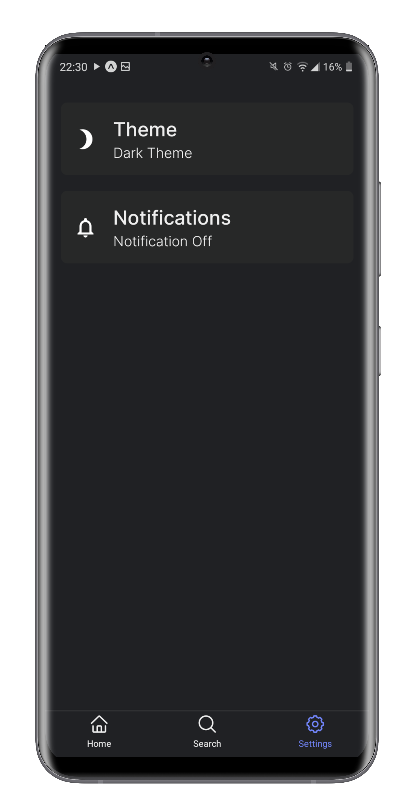

<h1 align="center"> SkyKow </h1>

<p align="center">
  <a href="https://github.com/ErickLuizA/SkyKow/graphs/commit-activity" alt="Maintenance">
    
  </a>

  <a href="./LICENSE" alt="License: MIT">
    
  </a>

<br/>


<a href="https://github.com/ErickLuizA/SkyKow/stargazers">
  
</a>

<p align="center">
  <a href="#clipboard-description">Description</a>&nbsp;&nbsp;&nbsp;|&nbsp;&nbsp;&nbsp;
  <a href="#building_construction-technologies">Technologies</a>&nbsp;&nbsp;&nbsp;|&nbsp;&nbsp;&nbsp;
  <a href="#rocket-getting-started">Getting Started</a>&nbsp;&nbsp;&nbsp;|&nbsp;&nbsp;&nbsp;
  <a href="#memo-license">License</a>&nbsp;&nbsp;&nbsp;|&nbsp;&nbsp;&nbsp;
  <a href="#framed_picture-screenshots">Screenshots</a>
</p>

## :clipboard: Description

SkyKow is a weather app built with react native

## :building_construction: Technologies

- [React Native](https://reactnative.dev/)
  - [Expo](https://expo.io)
  - [React Navigation](https://reactnavigation.org/)
  - [AsyncStorage](https://github.com/react-native-community/async-storage)
  - [Axios](https://github.com/axios/axios)

## :rocket: Getting Started

## 1. Download the repository

```shell
 $ git clone https://github.com/ErickLuizA/SkyKow.git
```

## 2. Installation

```shell
# Go into the repository
$ cd SkyKow

# Install dependencies
$ npm install
```

## 3. Execution

```shell
$ npm start or expo start(to run in the expo client)
```

## :memo: License

## :framed_picture: Screenshots

<div>
  
    
  
  
  
  
    
</div>


This project is under the MIT license. See the file [LICENSE](LICENSE) for more details.

---

Build with 💙 By [Erick](https://www.linkedin.com/in/erick-luiz-47151a1a4/)
